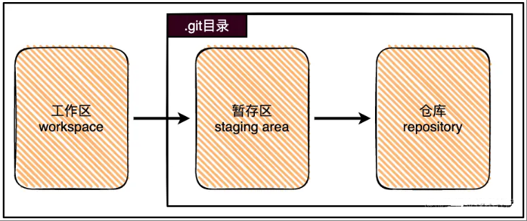

# Git Tutorials

## Table of Contents

- [Introduction](#introduction)
- [Get Started](#get-started)
- [Commands](#commands)
- [Useful Tools](#useful-tools)
- [Acknowledgement](#acknowledgement)

## Introduction

## Get Started

Start with a new repository

```bash
git init
```

clone an exist repository

```bash
git clone
```

## Commands

### **1、Pre-knowledge**

The Git local repository mainly consists of three parts: workspace, staging area, and repository.



The workspace is the directory on the local device, that is, the folder where the local warehouse is located.

The staging area represents a temporary storage area for saving the modified content to be submitted to the git repository.

Add modifications and deletions of tracked files are added to the staging area

```bash
git add -u
```

Add all changes in the current directory to the staging area, including tracked and untracked files

```bash
git add .
```


## Useful Tools

Visual Studio Code

Lazygit

## Acknowledgement